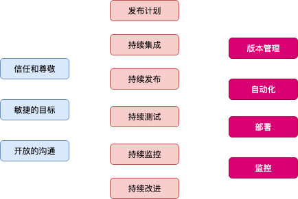
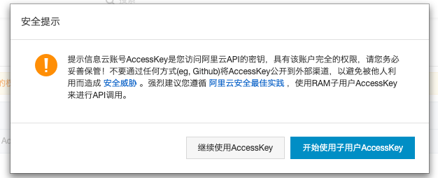
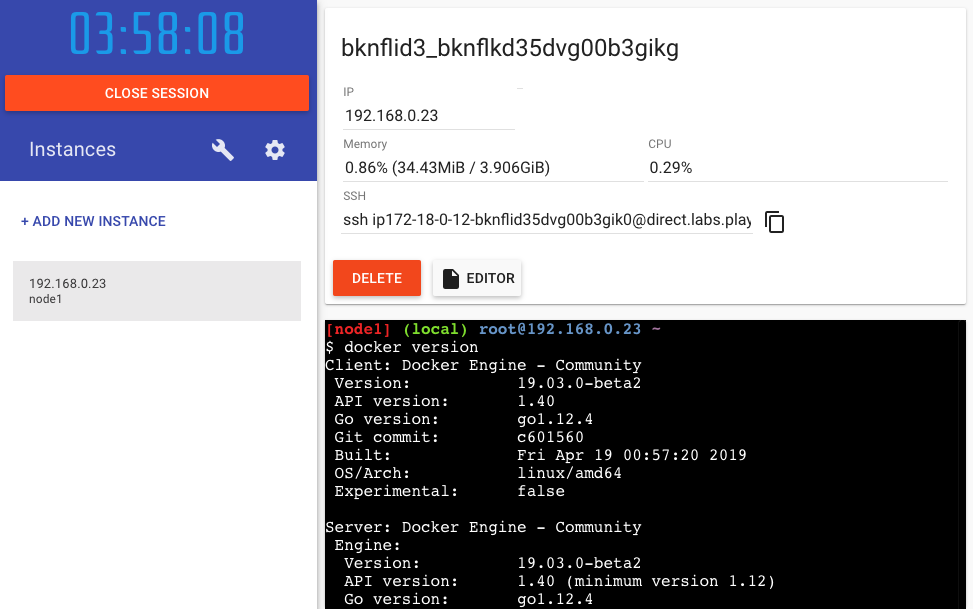

# DevOps


### Docker Engine


### Docker architecture


### Docker 能干什么？

* 简化配置
* 代码流水线管理
* 提高开发效率
* 隔离应用
* 整合服务器
* 调试能力
* 多租户
* 快速部署

### 容器时代
* docker & kubernetes(k8s)

### DevOps = 文化 + 过程 + 工具



### "石器时代"

* 部署非常慢
* 成本非常高
* 资源浪费
* 难于迁移和扩展
* 可能会被限定硬件厂商

### 虚拟化技术出现以后

* 一个物理机可以部署多个app
* 每个app独立运行在一个VM里

### 虚拟化的优点

* 资源池 - 一个物理机的资源分配到不同的虚拟机里面
* 很容易扩展 - 加物理机 Or 加虚拟机
* 很容易云化 - 亚马逊AWS,阿里云 

### 虚拟化的局限性

* 每一个虚拟机都是一个完整的操作系统，要给其分配资源，
当虚拟机资源增多时，操作系统本身消耗的资源势必增多

### 容器解决了什么问题

* 解决了开发与运维之间的矛盾
* 在开发与运维之间搭建了一个桥梁，是实现 devops 的最佳
解决方案

### 什么是容器

* 对软件和其依赖的标准化打包
* 应用之间相互隔离
* 共享同一个OS kernel
* 可以运行在很多主流操作系统之上

### 容器和虚拟机的区别

* 容器是App层面的隔离
* 虚拟化是物理资源层面的隔离

&nbsp;&nbsp;&nbsp;

### 虚拟化 + 容器

### Docker 

容器技术的一种实现

### Mac 上 Docker 安装

[Install Docker Desktop for Mac](https://docs.docker.com/docker-for-mac/install/)

**What the install includes: The installation provides Docker Engine, Docker CLI client, Docker Compose, Docker Machine, and Kitematic.**

```sh
docker --version
docker version
```

### Vagrant + VirtualBox搭建实验环境
**Development Environments Made Easy**

先安装 [VirtualBox](https://www.virtualbox.org/wiki/Downloads)

接下看 Vagrant 入门指南->[Getting Started](https://www.vagrantup.com/intro/getting-started/index.html)

[Vagrant Cloud](https://app.vagrantup.com/boxes/search)
* [centos/7 Vagrant box](https://app.vagrantup.com/centos/boxes/7)

```sh
vagrant --help

vagrant init centos/7 # 创建了一个 Vagrantfile

more Vagrantfile # 描述了我们要创建的虚机

vagrant up # 去找 base box(local or cloud)
vagrant ssh # 进入虚机
sudo yum update # 更新虚机
exit # 退出虚机

vagrant status # 查看虚机状态
vagrant halt # 停掉虚机

vagrant status # poweroff

vagrant destroy # 删掉虚机
```

创建一台虚机只需一个 `Vagrantfile` 文件即可

可以 google 搜索 Vagrantfile 如：`Vagrantfile CentOS`

创建一台虚机只需一个 `Vagrantfile` 文件即可

[CentOS 中安装 Docker, 直接看官方文档](https://docs.docker.com/install/linux/docker-ce/centos/) 

```sh
sudo yum remove docker docker-client docker-client-latest docker-common docker-latest docker-latest-logrotate docker-logrotate docker-engine

sudo yum install -y yum-utils device-mapper-persistent-data lvm2

sudo yum-config-manager --add-repo https://download.docker.com/linux/centos/docker-ce.repo

sudo yum install docker-ce

sudo systemctl start docker

sudo docker version # 查看版本信息

sudo docker run hello-world # 验证一下
```

在 Vagrantfile 中，我们直接可以配置机器启动时自动安装好Docker

```sh
config.vm.provision "shell", inline: <<-SHELL
  sudo yum remove docker docker-client docker-client-latest docker-common docker-latest docker-latest-logrotate docker-logrotate docker-engine
  sudo yum install -y yum-utils device-mapper-persistent-data lvm2
  sudo yum-config-manager --add-repo https://download.docker.com/linux/centos/docker-ce.repo
  sudo yum install docker-ce
  sudo systemctl start docker
SHELL
```

网络下载太慢，通过 `vagrant up` 我们可以直接拿到 box 的下载地址，然后迅雷下载

离线安装 centos7 box

```sh
cd ~/Vagrant/CentOS7 # 找到一个目录，作为初始化目录
vagrant box add centos/7 ~/Downloads/virtualbox.box # 建议采取离线安装，这样有利于放置虚拟机文件到指定路径
vagrant init centos/7 # 初始化 Vagrantfile
vagrant up #启动
vagrant ssh #进入VM
exit #退出
vagrant status #查看状态
vagrant halt #停掉
vagrant status #查看状态
vagrant destroy #删掉机器
```

查看boxes

```sh
cd ~/.vagrant.d/boxes
```
### Docker Machine

[Docker Machine Overview](https://docs.docker.com/machine/overview/)

mac 默认就已经安装好了

```sh
docker-machine version
```

Docker Machine 能干什么？(如：本地快速在 VirtualBox 环境中创建一台具有 Docker 环境的机器)

```sh
docker-machine --help # 习惯看帮助

docker-machine create demo # 我本地是直接在 VirtualBox 创建一个已经安装好了的虚拟机

docker-machine ls # 看看已经安装好了的机器
docker-machine ssh demo # 进入到机器里面
docker version
exit # 退出

docker-machine help # 查看帮助命令

docker-machine create demo1 # 再创建一台
docker-machine ls # 看一下
docker-machine stop demo1 # 停掉 demo1
docker-machine ls # 再看一下输出
docker-machine stop demo # 停掉 demo
```

### 做个试验，远程管理你的 docker machine

先退出本地 mac 启动 docker server

```sh
docker version #看一下是不是连不上 server
docker-machine start demo #启动下 demo
docker-machine env demo #暴露出环境变量

eval $(docker-machine env demo)
docker version #发现连上了，这种方式可以远程管理 docker machine, 本地只要一个 client 就好了
```

详细文档 [Provision hosts in the cloud](https://docs.docker.com/machine/get-started-cloud/)

### 阿里云上创建一台 Docker Machine

[Drivers for cloud providers](https://docs.docker.com/machine/drivers/)

[3rd-party driver plugins](https://github.com/docker/docker.github.io/blob/master/machine/AVAILABLE_DRIVER_PLUGINS.md)

仓库地址：[Docker Machine Driver of Aliyun ECS](https://github.com/AliyunContainerService/docker-machine-driver-aliyunecs)

`README.md` 有完整使用指南，👇简短说一下：

下载对应的 Driver, Mac OSX 64 bit: [docker-machine-driver-aliyunecs_darwin-amd64](https://docker-machine-aliyunecs-drivers.oss-cn-beijing.aliyuncs.com/docker-machine-driver-aliyunecs_darwin-amd64.tgz)

重命名 binary 档为 `docker-machine-driver-aliyunecs`，然后移动到 `/usr/local/bin`

验证一下，Driver 是否安装成功
```sh
docker-machine create -d aliyunecs --help
```

进入阿里云后台，可以直接进入 `accesskeys` 进行创建用户 AccessKey ID

好的方式还是直接根据提示按照 `使用子用户 AccessKey` 方式创建



**注意：要在控制台添加好子账号权限和充值100+**

```sh
docker-machine create -d aliyunecs --aliyunecs-io-optimized=optimized --aliyunecs-access-key-id=<your key> --aliyunecs-access-key-secret=<your secret> --aliyunecs-region=cn-qingdao devops

docker-machine ssh devops # 进入 shell
docker-machine env devops
eval $(docker-machine env devops)
docker version # 看一下有没有连上远端的 server

docker-machine env --help # 查看下帮助
docker-machine env --unset # 去掉刚设的环境变量
eval $(docker-machine env --unset) 

docker version
```

**应用：**，瞬间创 20 台机器去做`啦啦啦😋😝……` ，做完然后销毁🤣

### Online Docker Playground

[Play with Docker](https://labs.play-with-docker.com/)



### Docker 架构和底层技术

Docker Platform

* Docker 提供了一个开发，打包，运行 app 的平台
* 把 app 和底层 infrastructure 隔离开来

Docker Engine

* 后台进程(dockerd)
* REST API Server
* CLI 接口(docker)

```sh
vagrant ssh
sudo docker version
ps -ef | grep docker # 看到有dockerd的进程
```

Docker Architecture

Client
* docker build
* docker pull
* docker run

DOCKER_HOST
* Docker daemon
* Containers
* Images

Registry
* Ubuntu
* Redis
* Niginx
* ...images

底层技术的支持
* Namespaces：做隔离 pid, net, ipc, mnt, uts
* Control groups: 做资源限制
* Union file systems: Container 和 Image 分层

### 什么是 Image

* 文件和 meta data 的集合(root filesystem)
* 分层的，并且每一层都可以添加改变，删除文件，成为一个新的 image
* 不同的 image 可以共享相同的 layer
* Image 本身是 read-only 的

```sh
vagrant ssh
sudo docker image ls #列举出本地有的image
```

Image 的获取

* Build from Dockerfile
* Pull from Registry
  ```sh
  sudo docker image ls
  sudo docker pull ubuntu:14.04
  sudo docker image ls
  ```
### Docker Hub

[Docker Hub Quickstart](https://docs.docker.com/docker-hub/)

[hub.docker.com](https://hub.docker.com/)

### Base Image

在Vagrant中，解决当前用户 `docker` 前要加 `sudo` 的问题

```sh
sudo groupadd docker # 实质上安装好 docker 后，它已经存在了
sudo gpasswd -a vagrant docker # 将当前用户添加这个group里面
sudo service docker restart # 注意之后要重启 docker 进程

exit # 退出,重新登录
vagrant ssh
docker image ls # 现在就不用加 sudo 了
```

首先看一看 `hello-world` 这个 Base Image

```sh
docker pull hello-world #  这也是一个 base image，仅仅包含类似于一个可以执行的文件

docker image ls # 发现这个Image只有1.85kb，非常非常小

docker run hello-world # 这样就相当于创建了一个容器（执行一个Image)
```

### 制作 `Hello-Docker` Base Image

```sh
# vagrant ssh
# 安装一些必要的包
sudo yum install git
sudo yum install vim

mkdir hello-docker
cd hello-docker/
vim hello.c
#   #include<stdio.h>
#   int main()
#   {
#      printf("hello docker\n");
#   }

:wq # 保存退出 Vim 神器

history | grep yum # 看一下安装历史

# 安装编译器和静态版本库
sudo yum install gcc
sudo yum install glibc-static

gcc -static hello.c -o hello # 编译

ls # 发现多了一个可执行文件`hello`
./hello # 执行一次看一下

```

现在，就可以用 Dockerfile 把它弄成一个 Docker Image

```yaml
FROM scratch # 因为是base image,所以这里不能是其它
ADD hello / # 将这个`hello`添加到根目录
CMD ["/hello"] # 执行它
```

```sh
# 构建 然后打 tag，在当前目录下找Dockerfile，因为有三步，所以这个Image有三层
docker build -t kirkwwang/hello-docker .

docker image ls # 看一下,发现这个Image只有857KB

ls -lh # 看一下`hello`这个可执行文件,只有837KB

docker history b3a43698719c # 看一下这个image有几层，发现是两层，因为FROM scratch本身就没有FROM其它Image,可以不算作一层

docker run kirkwwang/hello-docker # 运行看一下，麻雀虽小，五脏俱全
```

### 什么是 Container

* 通过 Image 去创建(copy)
* 在 Image Layer 之上建立一个 container layer(可读写)
* 类比面向对象：类和实例
* Image 负责 app 存储和分发，Container 负责运行 app

```sh
docker container ls # 查看当前正在运行的容器
docker container ls -a # 查看所有的容器（正在运行的以及退出的）

more hello-docker/Dockerfile # 看CMD那一行，当我们 docker run 的时候，默认会去执行 CMD 里面的命令

docker run centos # 默认会用latest版本
docker container ls -a # 它默认执行的是/bin/bash，但也会退出，不是交互式运行，不常驻内存

docker run --help # 注意看帮助 -i，-t

docker run -it centos # 发现我们进入到了容器里面
touch test.txt # 多了一个可读可写的 container layer,我们来创建一个文件
ls
yum install vim # 再执行一条安装命令
```

开个新的terminal

```sh
cd ~/Vagrant/CentOS7
vagrant ssh
docker container ls # 发现有正在运行容器 centos，COMMAND 是 /bin/bash
```

退出容器

```sh
exit # 退出这个容器
docker container ls # 看不到正在运行的容器了
docker container ls -a
```

Docker 的命令分为两大块：Management Commands & Commands

Management Commands ：主要是对Docker里面的具体对象进行管理

```sh
docker image # 看一下image下又有那一些命令
docker image ls
docker container # 看一下container下又有那一些命令
docker container ls -a
docker container rm dfc145ac218f
docker container rm 3e # id 无需写全
```

Commands：提供一些简便方法，不用命令写的太长

```sh
docker ps #  == docker container ls
docker ps -a #  == docker container ls -a
docker rm cf # == docker container rm cf
docker images # == docker image ls
docker rmi fce289e99eb9 # docker image rm fce289e99eb9
```

如何一次性清理掉所有的容器?

```sh
docker run kirkwwang/hello-docker # 先创建5个container
docker run kirkwwang/hello-docker
docker run kirkwwang/hello-docker
docker run kirkwwang/hello-docker
docker run kirkwwang/hello-docker

docker ps -a # 看一下全部

docker container ls -aq # 列举出所有的id
docker container ls -a | awk {'print$1'} # 打印出第一列
docker rm $(docker container ls -aq) # 全部清理 == docker rm $(docker ps -aq)

# 只清理已经退出的
docker run kirkwwang/hello-docker # 先 run 5 个
docker container ls -f "status=exited" # 列出退出的容器
docker container ls -f "status=exited" -q # 列举出所有的id
docker rm $(docker container ls -f "status=exited" -q) # 只清理已经退出的
docker rm $(docker ps -f "status=exited" -q) # 同样的效果
```

### 基于一个 Container 构建 Image

基于某个 Image 创建一个 Container, 然后在这个 Container 里面做一些变化，如：安装了某个软件

把这个已经改变了的 Container， Commit 成一个新的 Image

```sh
# vagrant ssh
docker image ls
docker run -it centos
yum install -y vim
vim # 瞄一眼
exit # 退出
docker container ls -a # 看到一个退出状态的 centos

docker commit # 看一眼这个命令接收哪些参数
docker commit elastic_dewdney kirkwwang/centos-vim # elastic_dewdney 用的NAMES，kirkwwang/centos-vim 这个用的tag默认是latest

docker image ls # 看一眼images

# 比较一下 centos 与 kirkwwang/centos-vim 的分层
docker history centos
docker history kirkwwang/centos-vim # OK, 发现有vim的多了一层，其它的都是共享原来的
```

**不提倡这种方式创建 Image。发布出去，其实并不知道这个 Image 是如何产生的（鬼知道你里面安装啥软件[病毒]），不安全**

### 通过 Dockerfile 去构建一个 Image

```sh
docker image ls
docker image rm kirkwwang/centos-vim # 删掉刚创建的image

mkdir docker-centos-vim
cd docker-centos-vim
vim Dockerfile
```

`Dockerfile` 文件内容

```yml
FROM centos
RUN yum install -y vim
# 会创建一个临时的 Container 运行命令，然后去 Commit 成一个新的 Image
# 最后删掉那个临时的 Container
```

```sh
docker build -t kirkwwang/centos-vim-new . # -t 打 tag, `.`基本于当前目录的Dockerfile构建

docker image ls # 看一眼新生成的 image
```

### Dockerfile 最佳实践

[Best practices for writing Dockerfiles](https://docs.docker.com/develop/develop-images/dockerfile_best-practices/)

**FROM**

```yml
FROM scratch # 制作 Base Image
FROM centos # 使用 Base Image
FROM ubuntu:14.04
```

`为了安全，尽量使用官方的 Image 作为 Base Image！`

**LABEL**

```yml
LABEL maintainer="kirk.w.wang@gmail.com"
LABEL version="1.0"
LABEL description="This is description"
```

LABEL 类似于注释

`Metadata不可少`

**RUN**

```yml
RUN yum update && yum install -y vim \
    python-dev # 反斜线换行

RUN apt-get update && apt-get install -y perl \
    pwgen --no-install-recommends && rm -rf \
    /var/lib/apt/lists/* # 注意清理cache

RUN /bin/bash -c 'source $HOME/.bashrc;echo 
$HOME'
```
`为了美观，复杂的RUN请用反斜线换行！避免无用分层，合并多条命令成一行！`

**WORKDIR 设定当前工作目录**

```yml
WORKDIR /root

WORKDIR /test # 如果没有会自动创建test目录
WORKDIR demo
RUN pwd # 输出结果应该是 /test/demo
```

`用WORKDIR，不要用 RUN cd！尽量使用绝对目录！`

**ADD and COPY**

```yml
ADD hello /
ADD test.tar.gz / #添加到根目录并解压

WORKDIR /root
ADD hello test/ # /root/test/hello

WORKDIR /root
COPY hello test/
```

`大部分情况，COPY 优于 ADD! ADD 除了 COPY 还有额外功能（解压）！添加远程文件/目录请使用curl或者wget!`

**ENV**

```yml
ENV MYSQL_VERSION 5.6 # 设置常量
RUN apt-get install -y mysql-server="${MYSQL_VERSION}" \
    && rm -rf /var/lib/apt/lists/* # 引用常量

ENV
```

`尽量使用ENV增加可维护性`

**VOLUME and EXPOSE**

存储和网络

**CMD and ENTRYPOINT**

### Dockerfile 学习方式

[docker-library](https://github.com/docker-library)

[Dockerfile reference](https://docs.docker.com/engine/reference/builder/)

### RUN vs CMD vs Entrypoint

RUN:执行命令并创建新的Image Layer

CMD:设置容器启动后默认执行的命令和参数

ENTRYPOINT:设置容器启动时运行的命令

Shell 和 Exec格式

```sh
RUN apt-get install -y vim
CMD echo "hello docker"
ENTRYPOINT echo "hello docker"
```

Exec格式

```sh
RUN["apt-get", "install", "-y", "vim"]
CMD["/bin/echo", "hello docker"]
ENTRYPOINT["/bin/echo", "hello docker"]
```

Dockerfile1

```sh
FROM centos
ENV name Docker
ENTRYPOINT echo "hello $name"
```

Dockerfile2

```sh
FROM centos
ENV name Docker
ENTRYPOINT ["/bin/echo", "hello $name"]
```

Demo

```sh
mkdir cmd_vs_entrypoint
cd cmd_vs_entrypoint
vim Dockerfile # 放进去Dockerfile1
docker build -t kirkwwang/centos-entrypoint-shell . # shell格式构建
docker image ls
docker run kirkwwang/centos-entrypoint-shell # 运行看一下


vim Dockerfile # 放进去Dockerfile2
docker build -t kirkwwang/centos-entrypoint-exec . # exec格式构建
docker image ls
docker run kirkwwang/centos-entrypoint-exec
# [vagrant@bogon cmd_vs_entrypoint]$ docker run kirkwwang/centos-entrypoint-exec
# hello $name // 发现并没有进行变量替换，因为我们不是在shell里面去执行 echo，只是单纯的执行echo, 怎么改？
# ENTRYPOINT ["/bin/bash","-c","echo","hello $name"] 在 shell 里面执行 echo 命令

vim Dockerfile # 修改一下
docker build -t kirkwwang/centos-entrypoint-exec-new .
docker image ls
docker run kirkwwang/centos-entrypoint-exec-new # 发现打印出来的是空，Why？
# [vagrant@bogon cmd_vs_entrypoint]$ docker run kirkwwang/centos-entrypoint-exec-new
#

vim Dockerfile # 修改一下
# ENTRYPOINT ["/bin/bash","-c", "echo hello $name"] 把后面所有的命令作为一个去执行

docker build -t kirkwwang/centos-entrypoint-exec-new .
docker run kirkwwang/centos-entrypoint-exec-new # 现在就正常了

```

### CMD

容器启动时默认执行的命令

如果docker run指定了其它命令，CMD命令被忽略

如果定义了多个CMD，只有最后一个会执行

Dockerfile:

```yml
FROM centos
ENV name Docker
CMD echo "hello $name"
```

```sh
docker run [image] #输出?-->hello World
docker run -it [image] /bin/bash # 输出?-->CMD命令被忽略，因为指定了 `/bin/bash`
```

### ENTRYPOINT

让容器以应用程序或者服务的形式运行

不会被忽略，一定会执行

最佳实践：写一个shell脚本作为entrypoint

```yml
COPY docker-entrypoint.sh /usr/local/bin/
ENTRYPOINT ["docker-entrypoint.sh"] # 写一个 shell script

EXPOSE 27017
CMD ["mongod"]
```

实践(命令改成 shell)

```sh
docker rm $(docker ps -f "status=exited" -q) # 干掉已经退出的容器
docker rmi e2fc56ae6db7 # 删掉那个 none Image

vim Dockerfile # 修改ENTRYPOINT：CMD echo "hello $name"

docker build -t kirkwwang/centos-cmd-shell . # 构建

docker images # 查看一下
docker run kirkwwang/centos-cmd-shell
#hello Docker

docker run -it kirkwwang/centos-cmd-shell /bin/bash # 发现直接进入容器里面了

docker run kirkwwang/centos-entrypoint-shell #hello Docker

docker run -it kirkwwang/centos-entrypoint-shell /bin/bash
# hello Docker -->> 还是会运行 ENTRYPOINT
```

### 镜像的发布

[Docker Hub](https://hub.docker.com)

实践

```sh
# vagrant ssh
docker login

docker push kirkwwang/hello-docker # kirkwwang 一定是你的 Docker Id

docker rmi kirkwwang/hello-docker # 删掉本地的，拉取线上的

docker pull kirkwwang/hello-docker
```

这样去发布一个 docker image 是不安全的，因为别人不知道你在系统是不是加了病毒

推荐的方式是关联 Github 仓库等，里面提供Dockerfile, Docker Hub 自动帮我们根据 Dockerfile 构建

[Create Repository](https://cloud.docker.com/repository/create)

### 搭建私有的 Registry

[registry](https://hub.docker.com/_/registry)

登录另一台机器：

```sh
docker run -d -p 5000:5000 --restart always --name registry registry:2 # 创建一个容器运行App
```

本地测试一下，是否能连得上我们的伺服器。

```sh
sudo yum install -y telnet
telnet x.x.x.x 5000 # 本地测一下
# Trying xx.xx.xx.xx...
# Connected to xx.x.x.x.
# Escape character is '^]'. 
# 说明连接成功了
```

往私有的服务器去push

```sh
docker rmi kirkwwang/hello-world # 先干掉本地的Image
docker build -t x.x.x.x:5000/hello-world . # x.x.x.x 你自己服务器的ip
docker images
```

配置(因为默认我们的服务器是不可信任的)

```sh
sudo ls /etc/docker/ # 这个目录下，创建一个文件
sudo vim /etc/docker/daemon.json

sudo more /etc/docker/daemon.json
# {"insecure-registries":["x.x.x.x:5000"]} 让这个服务器可以信任的

sudo vim /lib/systemd/system/docker.service #编辑写docker的启动文件，加载刚刚的配置
# EnvironmentFile=-/etc/docker/daemon.json 加这么一行

sudo service docker restart
#Redirecting to /bin/systemctl restart docker.service
#Warning: docker.service changed on disk. Run 'systemctl daemon-reload' to reload units.

sudo systemctl daemon-reload

docker push xx.xx.xx.xx:5000/hello-world ## 好，看到成功了
```

如何验证推送成功了呢？

[Docker Registry HTTP API V2](https://docs.docker.com/registry/spec/api/)

[listing-repositories](https://docs.docker.com/registry/spec/api/#listing-repositories)

```sh
[vagrant@bogon hello-world]$ curl x.x.x.x:5000/v2/_catalog
{"repositories":["hello-world"]}
```

另外一种验证推送成功的方式：

```sh
docker rmi x.x.x.x:5000/hello-world # 删掉本地的
docker pull x.x.x.x:5000/hello-world
```

### Dockerfile 实战

```sh
mkdir flask-hello-world
cd flask-hello-world/

vim app.py
```

```py
from flask import Flask
app = Flask(__name__)
@app.route('/')
def hello()
   return "hello docker"
if __name__== "__main__":
   app.run()
```

```sh
vim Dockerfile
```

```yml
FROM python:2.7
LABEL maintainer="Kirk Wang<kirk.w.wang@gmail.com>"
RUN pip install flask
COPY app.py /app
WORKDIR /app
EXPOSE 5000
CMD ["python", "app.py"]
```

### Debug Dockerfile
```sh
docker build -t kirkwwang/flask-hello-world .

# 构建
# ....
# Step 4/7 : COPY app.py /app
# ---> 6e2811783304
# Step 5/7 : WORKDIR /app
# Cannot mkdir: /app is not a directory 尴尬，报错，进去这个中间状态的Image 6e2811783304 去看一眼

docker run -it 6e2811783304 /bin/bash # 发现 app 是个文件

vim Dockerfile # 修改 COPY app.py /app -> COPY app.py /app/
```

```yml
FROM python:2.7
LABEL maintainer="Kirk Wang<kirk.w.wang@gmail.com>"
RUN pip install flask
COPY app.py /app/
WORKDIR /app
EXPOSE 5000
CMD ["python", "app.py"]
```

```sh
docker build -t kirkwwang/flask-hello-world . # 构建
docker images # 看到了 kirkwwang/flask-hello-world
docker run kirkwwang/flask-hello-world # 创建一个容器，运行我们的 App
docker run -d kirkwwang/flask-hello-world # -d 后台执行
docker ps # 发现正在运行
```

### 容器的操作

对运行中的容器进行操作

```sh
docker ps
docker exec -it fdeee46afa69 /bin/bash # 对正在运行的容器执行/bin/bash，交互式的运行
ps -ef | grep python # 发现有进程在后台运行

exit # 退出
docker exec -it fdeee46afa69 python # 发现我们直接进入到了一个python的shell里面了

docker exec -it fdeee46afa69 ip a # 打印下容器的ip地址

docker stop fdeee46afa69 # ==docker container stop fdeee46afa69 停掉容器

docker rm $(docker ps -aq) # 清理所有的容器
docker rm $(docker ps -f "status=exited" -q) # 清理所有退出的容器

docker run -d --name=demo kirkwwang/flask-hello-world # 重新启动并且加个名字

docker ps # 看到了那个名字，不指定就随机分配一个

docker stop demo # 停掉

docker start demo # 启动

docker inspect demo # 查看下这个容器的详细信息

docker logs demo # 容器运行产生的一些输出
```

### 打包 Stress 压力测试工具

使用一下 Stress

```sh
mkdir ubuntu-stress
cd ubuntu-stress
docker run -it ubuntu # 运行并进入到容器里面
apt-get update && apt-get install -y stress # 安装 stress

which stress # 在/usr/bin/stress
stress --help
stress --vm 1 --verbose # 分配&释放
stress --vm 1 --vm-bytes 5000000M --verbose # 炸了，超出了 docker host 内存的限制了
top # 看下内存
```

打包
```sh
vim Dockerfile
```

```yml
FROM ubuntu
RUN apt-get update && apt-get install -y stress
ENTRYPOINT ["/usr/bin/stress"]
CMD [] # 接收参数
```

```sh
docker build -t kirkwwang/ubuntu-stress . # 构建
docker run -it kirkwwang/ubuntu-stress # 发现打印出了帮助信息
docker run -it kirkwwang/ubuntu-stress --vm 1 # stress 接受了vm等于1的参数
docker run -it kirkwwang/ubuntu-stress --vm 1 --verbose # 打印出所有的过程
```

ENTRYPOINT + CMD 比较典型利用 docker 在容器里面运行命令工具的方法

### 容器的资源限制

限制内存

```sh
docker run help ## --memory --memory-swap 不做限制就等于 memory
docker run --memory=200M kirkwwang/ubuntu-stress --vm 1 --verbose 
# 如果停不了，新开一个 vagrant ssh -->docker stop
# --memory=200M，其实有400M,因为 memory-swap 没指定就等于 memory
docker run --memory=200M kirkwwang/ubuntu-stress --vm 1 --verbose --vm-bytes 500M
## 总共才400M，指定了500M，肯定就炸了
```

限制CPU(注意观察)

shell 1
```sh
top
```

shell 2
```sh
docker run --cpu-shares=5 --name=test1 kirkwwang/ubuntu-stress --cpu 1
```

shell 3
```sh
docker run --cpu-shares=10 --name=test2 kirkwwang/ubuntu-stress --cpu 1
```

cpu-shares 去设置相对权重

### Docker Network 

单机：Bridge Network  Host Network  None Network

多机：Overlay Network

**Vagrant was unable to mount VirtualBox shared folders.错误解决方式**

[解决方案](https://github.com/scotch-io/scotch-box/issues/296)

```sh
vagrant plugin install vagrant-winnfsd
vagrant plugin install vagrant-vbguest
Vagrant up
```

实操：

外面是可以ping的通的
```sh
ping 192.168.205.10
ping 192.168.205.11

vagrant status
vagrant ssh docker-node1 # 进入第一台机器
docker version
ip a
ping 192.168.205.11 #是通的
```

如果实在装不了可以 `docker machine`

### 网络基础回顾

*基于数据包的通信方式*

*网络的分层*

*路由的概念*

*IP地址和路由*

*公有IP和私有IP*

```
A 10.0.0.0 -> 10.255.255.255 (10.0.0.0/8)
B 172.16.0.0 -> 172.31.255.255 (172.16.0.0/12)
C 192.168.0.0 -> 192.168.255.255 (192.168.0.0/16)
```

*网络地址转换NAT*

*Ping和telnet*

Ping(ICMP)：验证IP的可达性

telnet:验证服务的可用性

Wireshart 工具

### Linux网络命名空间(Docker 底层技术)

创建了一个容器(test1)，同时也就创建了一个 Linux Network Namespace, 和宿主机或其它容器是完全隔离的
```sh
# vagrant ssh docker-node1
sudo docker run -d --name test1 busybox /bin/sh -c "while true; do sleep 3600; done" # 这个 container 会一直在后台运行
```

显示容器(test1)有的网络接口(命名空间)

```sh
sudo docker exec -it test1 /bin/sh # 进入Container
ip a
```

显示当前容器(test1)有的网络接口(命名空间) lo: 本地回环口, eth0:

```
1: lo: <LOOPBACK,UP,LOWER_UP> mtu 65536 qdisc noqueue qlen 1000
    link/loopback 00:00:00:00:00:00 brd 00:00:00:00:00:00
    inet 127.0.0.1/8 scope host lo
       valid_lft forever preferred_lft forever
5: eth0@if6: <BROADCAST,MULTICAST,UP,LOWER_UP,M-DOWN> mtu 1500 qdisc noqueue
    link/ether 02:42:ac:11:00:02 brd ff:ff:ff:ff:ff:ff
    inet 172.17.0.2/16 brd 172.17.255.255 scope global eth0
       valid_lft forever preferred_lft forever
```

创建容器(test2),然后在它里面去 ping 容器(test1[172.17.0.2])
```sh
sudo docker run -d --name test2 busybox /bin/sh -c "while true; do sleep 3600; done"

docker ps # 看一下列表

sudo docker exec -it test2 /bin/sh # 进入 test2
ip a # 看一下自己的ip

ping 172.17.0.2 # ping test1 容器，是能够通的

```

### 创建和删除 Linux NetWork NameSpace

```sh
sudo ip netns list # 本机有的network namespace
sudo ip netns delete test1 # 删掉
sudo ip netns add test1 # 添加
sudo ip netns list
sudo ip netns add test1
sudo ip netns list
```
有两个 network namespace 了

刚才用 docker run 创建了两个容器，每个都有自己独立的 network namespace, 可以通过 docker exec 去查看 network namespace 里面的端口和ip地址

同理，我们如何去查看刚刚 linux 创建的 network namespace 它的 ip 呢 ？
```sh
sudo ip netns exec test1 ip a # 在 test1 这个
```
```
1: lo: <LOOPBACK> mtu 65536 qdisc noop state DOWN group default qlen 1000
    link/loopback 00:00:00:00:00:00 brd 00:00:00:00:00:00
```
看到现在有一个本地的回环口，特点：没有127.0.0.1地址，状态是 `DOWN` 的，没有运行起来

还可以在`NetWork NameSpace`里面执行 `ip link` 命令
```sh
ip link # 本机看一下

sudo ip netns exec test1 ip link # 在 test NS 里面执行
```

```
1: lo: <LOOPBACK> mtu 65536 qdisc noop state DOWN mode DEFAULT group default qlen 1000
    link/loopback 00:00:00:00:00:00 brd 00:00:00:00:00:00
```

只有一条lo(本地回环口)

好，现在让 lo 这个端口 up 起来
```sh
sudo ip netns exec test1 ip link set dev lo up
sudo ip netns exec test1 ip link #看一下
```
现在变成 UNKNOWN 了，Why?
这个端口要UP起来，要满足一个条件，需要两端是连起来的。
就像 eth0 和 mac 里面的一个虚拟化的端口连起来，就是说单个端口是没法 up 起来的，必须是一对。
```sh
1: lo: <LOOPBACK,UP,LOWER_UP> mtu 65536 qdisc noqueue state UNKNOWN mode DEFAULT group default qlen 1000
    link/loopback 00:00:00:00:00:00 brd 00:00:00:00:00:00
```